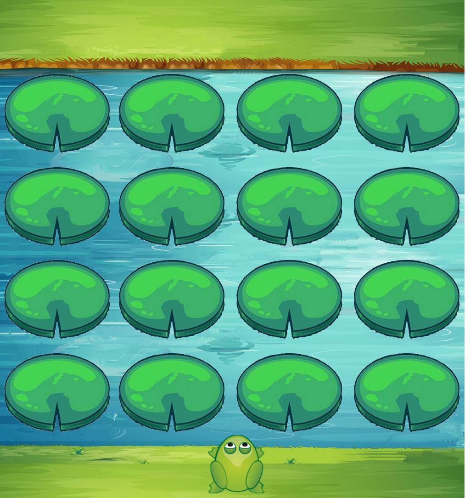

# Zeki Kurbağa İnteraktif Öğretim

####  Geliştirici
- Muhammed Eren DURSUN
- Bilgisayar ve Öğretim Teknolojileri Eğitimi

####  Proje Tanıtım
- Matematik Oyunu ile İnteraktif Öğretim
- Visual Studio C#

####  Projenin Amacı
- Öğenciye rastgele dört işlem sorusu yönlendirerek, nilüferlerin üzerinden belirli süre içerisinde kurbağayı karşıya geçirmeyi ve bu şekilde öğrenciye dört işlemi pratik bir şekilde yapabilme becerisini kazandırmak amaçlanmıştır.

# Galeri

# Video

Eklenecek...
